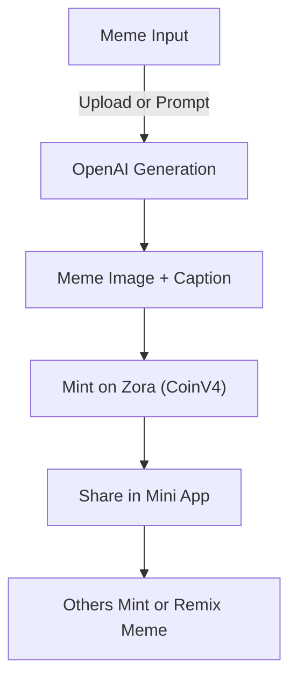

# Memetic Protocol

[ **Live App**](https://memetic-protocol.vercel.app/)

"Turn any meme into a monetizable asset. One click. One coin."

Memetic Protocol is a Mini App that lets anyone generate or upload a meme, instantly mint it as a Zora Coin (with optional NFT/collectible metadata), and share it with a built-in minting button.

It's a creative monetization engine where memes become micro-economies, enabling supporters to invest in viral content and creators to profit from attention—instantly.

---

## Vision

Memetic Protocol envisions a world where internet culture is not just viral, but valuable. We believe memes are the native language of the internet, and their creators deserve to capture the value they generate. By turning memes into onchain assets, we unlock new economic opportunities for creators, fans, and communities.

---

## Inspiration

The project is inspired by the explosive growth of meme culture and the lack of direct monetization for creators. While memes drive engagement and shape narratives, their creators rarely benefit financially. Memetic Protocol bridges this gap by combining the viral nature of memes with the programmability of crypto assets.

---

## Potential Impact

- **Empower Creators:** Anyone can monetize their creativity instantly, without needing sponsors or platforms.
- **Democratize Value:** Fans and communities can invest in and support the memes they love, creating new micro-economies.
- **Cultural Preservation:** Memes become digital artifacts, tracked and traded onchain, preserving internet culture for the future.
- **Remix Economy:** Enables collaborative creation and remixing, with transparent lineage and shared rewards.

---

## What It Does

Memetic Protocol turns memes into Zora Coins directly within a Mini App. The flow is:

1. **Create or upload a meme**  
   Users can type an idea (e.g., "Vitalik in a rave") and generate an image + caption using OpenAI (DALL·E + GPT-4) — or upload their own meme.
2. **Mint as a Zora Coin**  
   The meme is minted as a custom Zora Coin (via CoinV4), with onchain metadata: name, image, description, supply, and optional pricing logic.
3. **Share it in the Mini App**  
   The meme image, description, and a "Mint This Meme" button are available in the app, allowing others to collect and support.
4. **Supporters Mint or Trade**  
   Fans can mint the meme coin directly in the Mini App and optionally trade it (Uniswap v4 integration planned).

---

## Why It Matters

Most memes today go viral and die broke. Memetic Protocol brings economic life to viral content by:

- Rewarding creators instantly for popular media
- Letting fans participate in meme economics
- Creating a new asset class around cultural virality

---

## Built With

| Layer         | Stack Used                                |
| ------------- | ----------------------------------------- |
| Framework     | MiniKit by Base                           |
| Frontend      | Next.js + Tailwind CSS                    |
| Wallet        | Wagmi + WalletKit                         |
| AI Generation | OpenAI GPT-4 (caption) + DALL·E 3 (image) |
| Media Upload  | NFT.Storage or UploadThing                |
| Minting       | Zora CoinV4 SDK                           |
| Hosting       | Vercel (MiniKit optimized)                |

---

## Features

- **Meme Generator:** Upload an image or use AI to create one
- **GPT-4 Captioner:** Auto-generate meme text based on your prompt or image
- **Zora Coin Minting:** Every meme is minted into a custom token with metadata
- **Minting Composer:** Automatically provides a minting CTA for each meme
- **One-click Minting:** Fans can mint directly from the Mini App
- **Public Gallery (WIP):** All minted memes browsable in a memecoin explorer

---

## How It Works (Technical Flow)

---

## Use Cases

- Creators monetize memes without needing platforms or sponsorships.
- Fans can invest in the early virality of a meme by holding its coin.
- Collectors can curate their meme portfolios like digital artifacts.
- Communities can co-create, remix, and support visual culture onchain.

---

## What's Next

- **Uniswap v4 Liquidity Hook** — auto-provision trading pools for high-volume memes
- **Remix Tree Tracking** — lineage of meme forks and remix coins
- **Engagement-Based Airdrops** — reward top minters/supporters per meme
- **Meme Leaderboard** — daily trending memecoins

---
